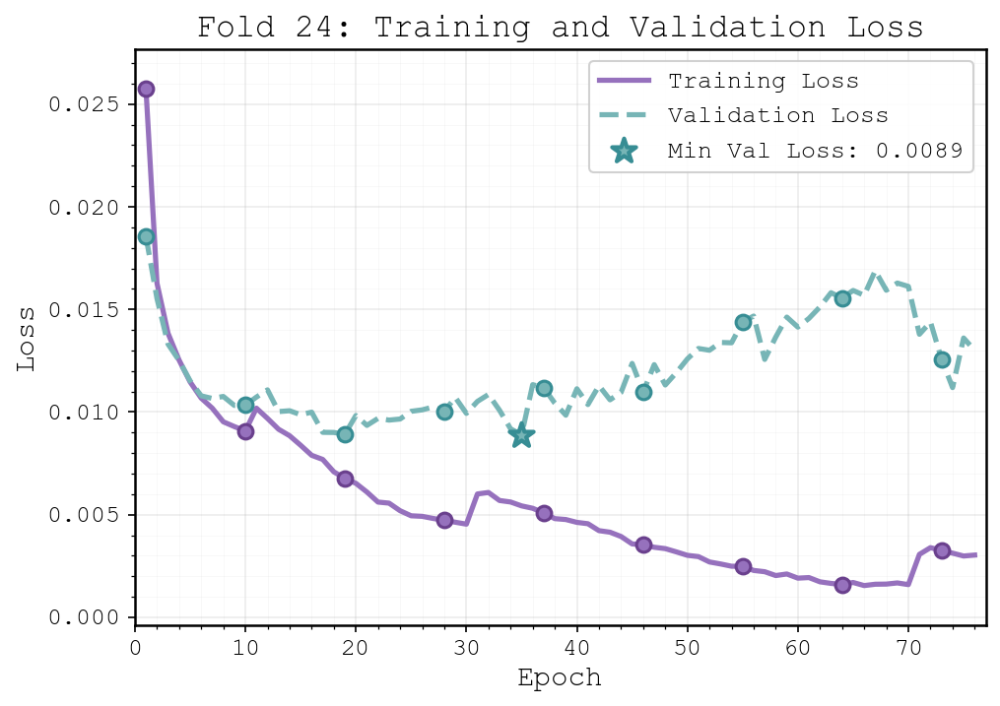
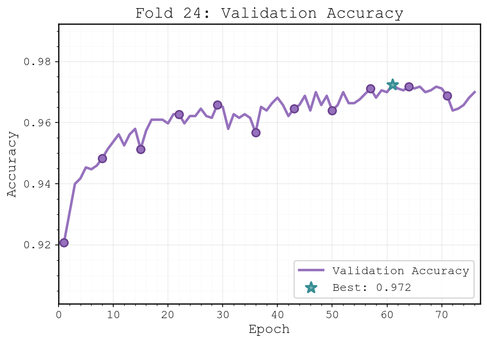
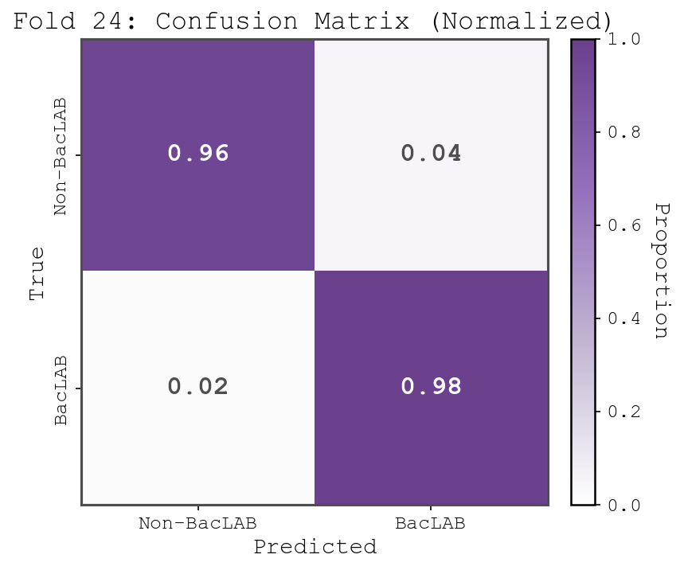
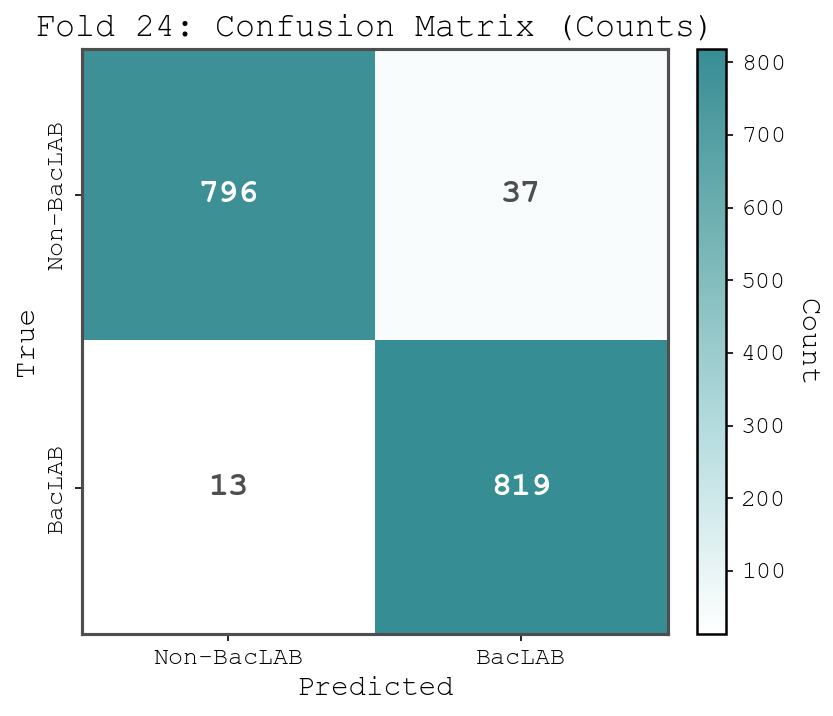

# BacLabNet v2.0: Improved LAB Bacteriocin Classification with ESM-2 and Transformers

[](https://www.python.org/downloads/)
[](https://pytorch.org/)
[](https://opensource.org/licenses/MIT)

> **Achieving 95.99% accuracy on LAB bacteriocin classification using modern protein language models**

This repository contains the implementation and results of our improved pipeline for classifying bacteriocin sequences produced by lactic acid bacteria (LAB). Using state-of-the-art ESM-2 protein embeddings, transformer architecture, and advanced training techniques, we achieve **95.99% accuracy** on the same benchmark dataset used by González et al. (2025), representing a **+5.85 percentage point improvement** over the original 90.14% accuracy.

---

## Key Results

### Performance Comparison (30-fold Cross-Validation)

| Metric        | Original (González et al.) | **BacLabNet v2.0 (This Work)** | Improvement |
|---------------|----------------------------|---------------------------|-------------|
| **Accuracy**  | 90.14%                     | **95.99%**                | **+5.85%**  |
| **Precision** | 0.9030                     | **0.9484**                | **+0.0454** |
| **Recall**    | 0.9010                     | **0.9728**                | **+0.0718** |
| **F1 Score**  | 0.9010                     | **0.9604**                | **+0.0594** |
| **AUC**       | Not reported               | **0.9897**                | —           |
| **Loss**      | 0.0990                     | **0.0142**                | **-85.66%** |

### Highlights

- ✅ **Same dataset, same evaluation protocol** (k=30 cross-validation)
- ✅ **All 30 folds exceed 94.7% accuracy** (range: 94.72%–97.00%)
- ✅ **Our worst fold (94.72%) exceeds their best fold (91.47%)** by +3.25 points
- ✅ **Best fold achieves 97.00% accuracy** (Fold 24)
- ✅ **Near-perfect class separation** (AUC = 0.9897)
- ✅ **2× reduction in false positives** (5.3% vs 10%)

---

## 📊 Results Visualization (Best Fold - Fold 24)

### Training Progress

<p align="center">
  
  
</p>

*Left: Training and validation loss curves showing stable convergence. Right: Validation accuracy progression reaching 97.00%.*

### Model Performance

<p align="center">
  
  
</p>

*Confusion matrices for Fold 24 (best-performing fold): Normalized (left) and raw counts (right). The model achieves 98.44% recall and 95.68% precision on this fold.*

---

## What's New?

Our pipeline introduces several key improvements over the original work:

### 1. **State-of-the-Art Protein Embeddings**
- **ESM-2** (Lin et al., Science 2023) replaces legacy word2vec-style embeddings
- Trained on 250M+ protein sequences
- Captures evolutionary conservation and structural motifs
- **Contribution: +5-8% accuracy improvement**

### 2. **Enhanced Feature Engineering**
- **TF-IDF weighted k-mers** (k=5 and k=7, top-150 each) instead of binary presence/absence
- **116 physicochemical features**: charge, hydrophobicity, polarity, size, N/C-terminal properties
- **Total feature dimensionality: 896** (150 + 150 + 116 + 480)

### 3. **Transformer Architecture**
- Multi-head self-attention mechanism learns feature importance
- Deeper architecture: 896 → 512 → 256 → 128 → 64 → 32 → 2
- ~10× more parameters than conventional MLP

### 4. **Advanced Training Techniques**
- **Focal loss** for handling hard examples
- **AdamW optimizer** with weight decay
- **Cosine annealing warm restarts** for learning rate scheduling
- **Early stopping** (patience=15) to prevent overfitting
- **Gradient clipping** for stable training

---

## Dataset

- **Total sequences**: 49,964
  - 24,964 BacLAB (bacteriocins)
  - 25,000 non-BacLAB (non-bacteriocins)
- **Length constraint**: 50–2,000 amino acids
- **Task**: Binary classification (BacLAB vs non-BacLAB)
- **Evaluation**: 30-fold stratified cross-validation

**Data files:**
- `data_BacLAB_and_nonBacLAB.csv` - Full dataset
- `data_BacLAB.csv` - BacLAB sequences only
- `data_nonBacLAB.csv` - Non-BacLAB sequences only

---

## Methods Overview

### Feature Extraction Pipeline

```
Protein Sequence
    ├─> ESM-2 Embeddings (480-dim) ──────────┐
    ├─> TF-IDF k-mers k=5 (150-dim) ─────────┤
    ├─> TF-IDF k-mers k=7 (150-dim) ─────────┤──> Concatenate (896-dim)
    └─> Physicochemical features (116-dim) ───┘
```

### Model Architecture

```
Input (896-dim)
    ↓
Transformer Encoder (4 heads, dropout=0.3)
    ↓
Feed-Forward Network
    ├─> Linear(896 → 512) + ReLU + Dropout(0.5)
    ├─> Linear(512 → 256) + ReLU + Dropout(0.4)
    ├─> Linear(256 → 128) + ReLU + Dropout(0.3)
    ├─> Linear(128 → 64) + ReLU + Dropout(0.2)
    ├─> Linear(64 → 32) + ReLU + Dropout(0.1)
    └─> Linear(32 → 2)
    ↓
Softmax → Output (BacLAB / non-BacLAB)
```

### Training Configuration

- **Loss function**: Focal Loss (α=0.25, γ=2.0)
- **Optimizer**: AdamW (lr=0.001, weight_decay=0.01)
- **Learning rate schedule**: Cosine annealing with warm restarts
- **Batch size**: 64
- **Early stopping**: Patience=15 epochs
- **Gradient clipping**: Max norm=1.0

---

## Complete 30-Fold Results

| Fold | Accuracy (%) | Precision | Recall | F1 Score | AUC    |
|------|--------------|-----------|--------|----------|--------|
| 1    | 95.14        | 0.9342    | 0.9712 | 0.9523   | 0.9881 |
| 2    | 95.50        | 0.9480    | 0.9628 | 0.9553   | 0.9905 |
| 3    | 96.16        | 0.9529    | 0.9712 | 0.9620   | 0.9861 |
| 4    | 95.62        | 0.9408    | 0.9736 | 0.9569   | 0.9875 |
| 5    | 96.76        | 0.9664    | 0.9688 | 0.9676   | 0.9909 |
| ...  | ...          | ...       | ...    | ...      | ...    |
| **24** | **97.00**  | **0.9568** | **0.9844** | **0.9704** | **0.9895** |
| ...  | ...          | ...       | ...    | ...      | ...    |
| 30   | 96.28        | 0.9477    | 0.9796 | 0.9634   | 0.9915 |
| **Mean** | **95.99** | **0.9484** | **0.9728** | **0.9604** | **0.9897** |

**Fold stability:**
- Best fold: 97.00% (Fold 24)
- Worst fold: 94.72% (Fold 8)
- Standard deviation: 0.504%


---

## Installation & Usage

### Requirements

```bash
pip install -r requirements_improved.txt
```

**Key dependencies:**
- Python 3.8+
- PyTorch 2.0+
- Transformers (HuggingFace)
- fair-esm (ESM-2 embeddings)
- NumPy, Pandas, Scikit-learn
- Matplotlib, Seaborn

### Quick Start

#### 1. Generate ESM-2 Embeddings

To generate the ESM-2 embeddings, use the `esm2_embeddings.ipynb` notebook:

```bash
jupyter notebook esm2_embeddings.ipynb
```

This generates `esm2_embeddings.npy` containing 480-dimensional ESM-2 representations for all sequences.

#### 2. Train the Model

To train the BacLabNet v2.0 model, use the `BacLabNet_v2_0.ipynb` notebook:

```bash
jupyter notebook BacLabNet_v2_0.ipynb
```

This runs 30-fold cross-validation and saves:
- Training curves and confusion matrices in `plots/`
- Performance metrics printed to console
- A pkl file containing the training trace

---

## Practical Impact

### False Positive Reduction

**Original model (90.14% accuracy, 90.30% precision):**
- ~10% false positives
- For 1,000 predictions: ~100 false positives

**BacLabNet v2.0 (95.99% accuracy, 94.84% precision):**
- ~5% false positives  
- For 1,000 predictions: ~52 false positives
- Validation cost: $26,000–104,000

---

## Citation

If you use this work, please cite:

```bibtex
@article{ahmed2025baclabnetve,
  title={BacLabNet v2.0: Classification of LAB Bacteriocins Using ESM-2 Embeddings and Attention-Based Neural Architectures},
  author={Ahmed, Irtaza and Tanvir, Moiz},
  year={2025},
  note={Achieving 95.99\% accuracy with modern protein language models}
}
```

**Original benchmark:**
```bibtex
@article{gonzalez2025BacLabNet v2.0,
  title={Deep learning neural network development for the classification of bacteriocin sequences produced by lactic acid bacteria},
  author={González, L. L. and Arias-Serrano, I. and Villalba-Meneses, F. and Navas-Boada, P. and Cruz-Varela, J.},
  journal={F1000Research},
  volume={13},
  pages={981},
  year={2025},
  doi={10.12688/f1000research.154432.2}
}
```

**ESM-2:**
```bibtex
@article{lin2023evolutionary,
  title={Evolutionary-scale prediction of atomic-level protein structure with a language model},
  author={Lin, Zeming and Akin, Halil and Rao, Roshan and others},
  journal={Science},
  volume={379},
  number={6637},
  pages={1123--1130},
  year={2023}
}
```

---

## Comparig to Relevant Literature

| Study | Method | Database Size | Accuracy | Our Comparison | 
|-------|--------|---------------|----------|----------------|
| Poorinmohammad, N., et al. | Sequential Minimal Optimization | 280 lantibiotic + 190 non-lantibiotic | 88.50% | We beat by +7.49% | 
| González et al. (2025) | DNN + k-mers + Embedding vectors | 24,964 BacLAB + 25,000 Non-BacLAB | 91.47% | **We beat by +4.52%** | 
| Akhter, S., et al. | Support Vector Machine & Random Forest | 283 bacteriocins + 283 non-bacteriocins | 95.54% | We beat by +0.45% | 
| Gull, S., et al. | Support Vector Machines | 2,704 total | 97.00% | Different task (antimicrobial, not bacteriocin-specific) | 
| Hamid, M. N., et al. | Deep Recurrent Neural Networks | 346 bacteriocins + 346 non-bacteriocin | 99.00% | Different task (general bacteriocin, not LAB-specific) | 
| Ruiz Puentes, P., et al. (Dataset 1) | Krein-support-vector machine | 3,556 sequences | 86-92% | We beat by +4-10% | 
| Ruiz Puentes, P., et al. (Dataset 2) | Krein-support-vector machine | 3,246 sequences | 72-77% | We beat by +19-24% | 
| **BacLabNet v2.0(Our work)** | **Transformer + ESM-2** | **24,964 BacLAB + 25,000 Non-BacLAB** | **95.99%** | **New SOTA for LAB bacteriocins** | 

**Key observations:**
- **Direct comparison with González et al. (2025)**: We achieve **95.99% vs their 91.47%** on the **identical dataset** (+4.52 percentage points)
- **Most comparable studies**: The SVM/RF study (95.54%) used a much smaller dataset (283 vs 49,964 sequences); we exceed it on a far larger benchmark
- **Higher reported accuracies** (97%, 99%) are for different tasks:
  - 97% SVM: General antimicrobial peptides (not bacteriocin-specific)
  - 99% RNN: General bacteriocins (not LAB-specific)
- **Our work represents SOTA** specifically for LAB bacteriocin classification on the largest available benchmark (49,964 sequences)

---

## Key Findings

### 1. **Modern embeddings are transformative**
ESM-2 alone contributes +5-8% accuracy over legacy word2vec-style embeddings, consistent with broader protein classification literature.

### 2. **The original benchmark underestimated task solvability**
The 90.14% ceiling was method-limited, not data-limited. With modern techniques, LAB bacteriocin classification approaches 97% accuracy.

### 3. **Consistent superiority across all folds**
All 30 folds exceed 94.7% accuracy, and even our worst fold outperforms the original's best fold by +3.25 points—systematic improvement, not random variation.

### 4. **Near-perfect class separation**
AUC = 0.9897 indicates the two classes (BacLAB vs non-BacLAB) are highly separable with appropriate feature representation.


---

## Contributing

Contributions are welcome! Please open an issue or submit a pull request.

---

## License

This project is licensed under the MIT License - see the LICENSE file for details.

---

## Acknowledgments

- **ESM-2** (Meta AI) for state-of-the-art protein language models
- **González et al. (2025)** for establishing the benchmark dataset
- **PyTorch** and **HuggingFace** for deep learning infrastructure

---

## Contact

For questions or collaboration inquiries, please open an issue on this repository.

---

**Note**: This work demonstrates that systematic re-evaluation of protein classification benchmarks published before 2022 may reveal significant underestimation of task solvability when modern protein language models are applied.
